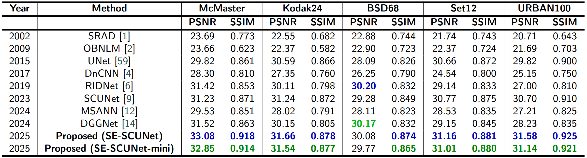

# Hybrid CNN–Transformer with Channel Recalibration for Speckle Denoising

This repository contains the official implementation of the paper:

**Hybrid CNN–Transformer with Channel Recalibration for Robust Despeckling in Real-Time Imaging**  
Abdullahi Sani Shuaibu, Shujaat Khan, Saheed A. Bello, Blessed Guda, Mohammed Bennamoun  
*Submitted to Knowledge-Based Systems (Elsevier), 2025*  
[Paper Link]()

SE-SCUNet introduces a hybrid CNN–Transformer denoising architecture enhanced with **Squeeze-and-Excitation (SE)** blocks for channel-wise recalibration. We also propose **SE-SCUNet-mini**, a lightweight version optimized for real-time use in medical and embedded scenarios.

---

## 🗂️ Directory Overview

```
se_scunet/
├── train/
│ ├── scunet.ipynb              # SCUNet
│ ├── scunet-sae.ipynb          # SCUNet + SE blocks
│ ├── scunet-mini-sae.ipynb     # Lightweight SE-SCUNet-mini
│ └── unet.ipynb                # Baseline U-Net
├── test/
│ └── test.ipynb                # Inference script
├── datasets/                   # Dataset folders (see Data Preparation section)
│ └── ....
├── checkpoints/                # Saved models (after training)
│ └── ....
├── results/                    # Result visualizations (after testing)
│ └── ....
├── figures/                    # Sample visual results
│ └── ....
├── README.md
```

---

## ⚙️ Requirements

Install dependencies via:

```bash
pip install -r requirements.txt
```

---

## 📂 Data Preparation

To train and evaluate the models, you must manually download the datasets and place the raw grayscale images in the correct folders. All images should be placed directly inside their respective `/original` subfolders as shown below.

```
datasets/
├── 01-Mcmaster/original/       ← Place McMaster images here
├── 02-Kodak24/original/        ← Place Kodak24 images here
├── 03-CSBSD68/original/        ← Place CSBSD68 images here
├── 04-set12/original/          ← Place Set12 images here
├── 05-URBAN100/original/       ← Place URBAN100 images here
├── 06-BUSI/original/           ← Place BUSI ultrasound images here
├── coco/original/              ← Place COCO images here (any number; we used 5,000)
```

### 🔗 Dataset Download Links (add manually)

- **McMaster**: [link](https://www4.comp.polyu.edu.hk/~cslzhang/CDM_Dataset.htm)
- **Kodak24**: [link](https://r0k.us/graphics/kodak)
- **CSBSD68**: [link](https://www2.eecs.berkeley.edu/Research/Projects/CS/vision/bsds/)
- **Set12**: [link](https://drive.google.com/drive/folders/1p9nRrc6WDRZ7m_YRVmiwiqeGhhjOK-em?usp=sharing)
- **URBAN100**: [link](https://www.kaggle.com/datasets/harshraone/urban100)
- **BUSI (Ultrasound)**: [link](https://scholar.cu.edu.eg/?q=afahmy/pages/dataset)
- **COCO**: [link](https://cocodataset.org/#download)

> ⚠️ All images should be stored as raw `.png | .jpg | .jpeg` files directly inside the `original` folders. No subfolders or annotations are required. Some datasets (e.g: McMaster) may require conversion from `.tif` format.


---


## 🏋️‍♂️ Training

Training notebooks are located in the `train/` folder. Each notebook trains a specific model on grayscale images corrupted with speckle noise.

- Noise is generated using Rayleigh distribution with optional Gaussian blur (to simulate PSF).
- 5,000 COCO images are cropped into 128×128 patches:  
  → 65,002 for training, 3,429 for validation.

---

## 🧪 Testing

Use `test/test.ipynb` to evaluate any trained model:

- It loads models from `checkpoints/`
- Evaluates PSNR and SSIM
- Visualizes denoising results

---

## 🧠 Models

> 🔽 **Download trained models**:  
> All trained model weights are available
> [here](https://mega.nz/file/MNBRDBAT#7On3E3xZYb_mJe2dcR8Rn2QrdD-dwYmk8Yd2AeZ6of8).  
> Please place the downloaded `.pth` files in the `checkpoints/` directory.

| Model                  | Description                            | Params | Inference Time |
|------------------------|----------------------------------------|--------|----------------|
| scunet             | Swin-Conv UNet                         | High   | Moderate       |
| se-scunet         | SCUNet with SE blocks                  | High   | Moderate       |
| se-scunet-mini    | Lightweight SE-SCUNet-mini             | Low    | Fastest        |

---

## 📊 Results


### PSNR VS SSIM

The following table summarizes PSNR and SSIM performance on five standard benchmark datasets under speckle noise (σ = 0.15). Best and second-best results are highlighted in **blue** and **green**, respectively.



> See Table 2 in the paper for detailed breakdown across McMaster, Kodak24, BSD68, Set12, and URBAN100 datasets.

### BUSI Dataset Performance

| Dataset | Metric             | SCUNet   | SE-SCUNet | SE-SCUNet-mini |
|---------|--------------------|----------|-----------|----------------|
| BUSI    | PSNR (dB)          | 32.82    | **33.91** | 33.84          |
| BUSI    | SSIM               | 0.889    | **0.905** | **0.905**      |
| BUSI    | Inference (ms)     | 123.94   | 125.34    | **57.17**      |
| BUSI    | FLOPs (G)          | 197.79   | 197.82    | **104.53**     |
| BUSI    | Params (Millions)  | 9.651    | 9.661     | **4.871**      |


> See Table 3, Figure 14 & 15 in the paper for full results.


---

## 🖼️ Sample Visualization

The following figures show qualitative denoising performance of SE-SCUNet-mini on various benchmark datasets under increasing speckle noise levels (σ = 0.15 to 1.00).


#### 📌 CSBD68


#### 📌 Kodak24


#### 📌 McMaster


#### 📌 Set12


#### 📌 URBAN100


#### 📌 BUSI (Ultrasound)


---

## 📜 Citation

If you use this code or reference this work, please cite:

```bibtex
@article{shuaibu2024sescunet,
  title={Hybrid CNN--Transformer with Channel Recalibration for Robust Despeckling in Real-Time Imaging},
  author={Shuaibu, Abdullahi Sani and Khan, Shujaat and Bello, Saheed A. and Guda, Blessed and Bennamoun, Mohammed},
  journal={Knowledge-Based Systems},
  year={2024},
  note={Submitted}
}
```

---

## 📬 Contact

For questions or collaborations:

- Abdullahi Sani — sanishuaibsp@gmail.com
- Shujaat Khan — shujaat.khan@kfupm.edu.sa  
